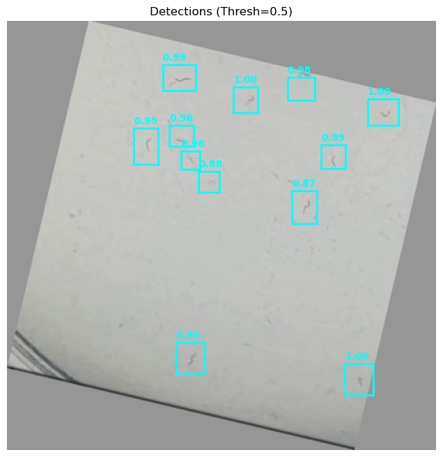

# Worm Detection ML Pipeline

**Complete machine learning pipeline for C. elegans / Nematode detection in petri dishes**

---

## Table of Contents

1. [Overview](#overview)
2. [Pipeline Components](#pipeline-components)
3. [Quick Start](#quick-start)
4. [Detailed Workflow](#detailed-workflow)
5. [Installation](#installation)
6. [Usage Examples](#usage-examples)
7. [Model Architecture](#model-architecture)
8. [Performance Tips](#performance-tips)

---

## Overview

This pipeline provides a **complete end-to-end solution** for training custom ML models to detect worms in microscopy images, even with **limited training data**.

### Key Features

- **Interactive annotation tool** - Web-based UI for manual labeling  
- **Advanced data augmentation** - Generate 10-20x more training samples  
- **Transfer learning** - Leverage pre-trained models (Faster R-CNN)  
- **Custom architectures** - Lightweight CNN alternative  
- **Multiple export formats** - COCO JSON, YOLO, Pascal VOC  
- **Training pipeline** - Complete PyTorch implementation  
- **Inference & visualization** - Predict on new images  

---

## 🧪 Experimental Results (Single Image Training)

> **⚠️ NOTE: Random Experiment / Work in Progress**
>
> This project is currently a **random experiment** to test the limits of data augmentation.
> The current model is trained on **ONLY ONE SINGLE IMAGE** (`dish_001.png`) which was sliced and heavily augmented to create a synthetic dataset.
>
> **Current Status:**
>
> - The model is likely **heavily overfitted** to the specific lighting and conditions of the single training image.
> - I haven't got any more images to test yet.
> - I will add proper test results once I acquire more data.
>
> **📢 Call for Data:**
> If you have similar microscopy images of petri dishes (nematodes/worms), **please contact me!** I would love to test the model on new data to verify its generalization capabilities.

### 1. Training Performance

Training on M1 Mac (8GB RAM) using MobileNetV3-SSDLite.


### 2. Original vs. Prediction

**Original Image (The only training sample):**


**Model Prediction (Unseen augmentation):**



---

## Pipeline Components

### 1. **Annotation Tool** (`worm_annotation_tool.html`)

- Interactive web-based labeling interface
- Supports bounding boxes, polygons, and points
- Real-time visualization
- Export to COCO JSON and YOLO formats

### 2. **Data Augmentation** (`data_augmentation.py`)

- Geometric transformations (rotation, flip, crop, zoom)
- Color adjustments (brightness, contrast, hue, saturation)
- Noise injection (Gaussian, salt-pepper)
- Blur effects (Gaussian, motion blur)
- Elastic deformations
- **Generates 10-20x more training samples from limited data**

### 3. **ML Model** (`ml_model_training.py`)

- **Faster R-CNN** with ResNet-50 backbone (recommended)
- **Custom CNN** architecture (lightweight alternative)
- Transfer learning from COCO pre-trained weights
- Full training pipeline with validation
- Model checkpointing and early stopping

---

## Quick Start

### Step 1: Annotate Your Images

```bash
# Open the annotation tool in your browser
open worm_annotation_tool.html

# Or serve it:
python -m http.server 8000
# Then navigate to http://localhost:8000/worm_annotation_tool.html
```

**Annotation Instructions:**

1. Load your worm image
2. Select "Bounding Box" tool
3. Click and drag to draw boxes around each worm
4. Export annotations (COCO JSON or YOLO format)
5. Repeat for 5-10 images minimum

### Step 2: Generate Augmented Data

```python
from data_augmentation import WormDataAugmentor

# Initialize augmentor
augmentor = WormDataAugmentor(output_dir='augmented_worm_data')

# Generate 20 augmented versions of each image
augmentor.generate_augmentations(
    image_path='path/to/your_image.jpg',
    label_path='path/to/your_labels.txt',
    num_augmentations=20,
    format='yolo'
)
```

**Result:** 5 original images → 100+ training samples!

### Step 3: Train the Model

```python
from ml_model_training import WormDetectionTrainer, WormDetectionDataset
from torch.utils.data import DataLoader

# Create dataset
dataset = WormDetectionDataset(
    image_dir='augmented_worm_data/images',
    label_dir='augmented_worm_data/labels'
)

# Initialize trainer
trainer = WormDetectionTrainer(
    model_type='fasterrcnn',  # or 'custom'
    num_classes=2  # background + worm
)

# Train
history = trainer.train(
    train_loader=train_loader,
    val_loader=val_loader,
    num_epochs=50,
    lr=0.001
)
```

### Step 4: Make Predictions

```python
# Load trained model
trainer.load_model('best_worm_detector.pth')

# Predict on new image
predictions = trainer.predict(
    image='new_petri_dish.jpg',
    confidence_threshold=0.5
)

# Visualize results
trainer.visualize_predictions(
    image_path='new_petri_dish.jpg',
    save_path='detection_result.png'
)
```

---

## Detailed Workflow

### Workflow Diagram

```
Raw Images (5-10 samples)
         ↓
   [Annotation Tool]
         ↓
Labeled Data (YOLO/COCO format)
         ↓
  [Data Augmentation]
         ↓
Augmented Dataset (100+ samples)
         ↓
   [Train/Val Split]
         ↓
   [ML Model Training]
         ↓
Trained Model (.pth)
         ↓
   [Inference Pipeline]
         ↓
Worm Detections on New Images
```

### Detailed Steps

#### Phase 1: Data Collection & Annotation

1. **Collect images** (minimum 5-10 petri dish images)
2. **Open annotation tool** (`worm_annotation_tool.html`)
3. **Label worms** using bounding boxes
4. **Export annotations** in YOLO or COCO format
5. **Organize data:**

   ```
   raw_data/
   ├── images/
   │   ├── img_001.jpg
   │   ├── img_002.jpg
   │   └── ...
   └── labels/
   │   ├── img_001.txt
   │   ├── img_002.txt
   │   └── ...
   ```

#### Phase 2: Data Augmentation

```python
import os
from data_augmentation import WormDataAugmentor

augmentor = WormDataAugmentor(output_dir='augmented_worm_data')

# Process all images
for img_file in os.listdir('raw_data/images'):
    if img_file.endswith(('.jpg', '.png')):
        img_path = f'raw_data/images/{img_file}'
        label_path = f'raw_data/labels/{img_file.replace(".jpg", ".txt")}'
        
        augmentor.generate_augmentations(
            image_path=img_path,
            label_path=label_path,
            num_augmentations=20,
            format='yolo'
        )
```

**Output structure:**

```
augmented_worm_data/
├── images/
│   ├── img_001_aug_0.jpg
│   ├── img_001_aug_1.jpg
│   ├── ...
└── labels/
    ├── img_001_aug_0.txt
    ├── img_001_aug_1.txt
    └── ...
```

#### Phase 3: Training

```python
import torch
from torch.utils.data import DataLoader, random_split
from ml_model_training import WormDetectionTrainer, WormDetectionDataset

# Create dataset
full_dataset = WormDetectionDataset(
    image_dir='augmented_worm_data/images',
    label_dir='augmented_worm_data/labels'
)

# Split train/val (80/20)
train_size = int(0.8 * len(full_dataset))
val_size = len(full_dataset) - train_size
train_dataset, val_dataset = random_split(full_dataset, [train_size, val_size])

# Create dataloaders
def collate_fn(batch):
    return tuple(zip(*batch))

train_loader = DataLoader(train_dataset, batch_size=4, shuffle=True, collate_fn=collate_fn)
val_loader = DataLoader(val_dataset, batch_size=4, shuffle=False, collate_fn=collate_fn)

# Initialize trainer
trainer = WormDetectionTrainer(
    model_type='fasterrcnn',
    num_classes=2
)

# Train
history = trainer.train(
    train_loader=train_loader,
    val_loader=val_loader,
    num_epochs=50,
    lr=0.001
)
```

#### Phase 4: Inference

```python
# Load best model
trainer.load_model('best_worm_detector.pth')

# Predict on single image
predictions = trainer.predict('test_image.jpg', confidence_threshold=0.6)

print(f"Detected {len(predictions['boxes'])} worms")
for i, (box, score) in enumerate(zip(predictions['boxes'], predictions['scores'])):
    print(f"Worm {i+1}: Box={box}, Confidence={score:.2f}")

# Visualize
trainer.visualize_predictions('test_image.jpg', save_path='results.png')
```

---

## Installation

### Requirements

```bash
# Core dependencies (already available)
pip install opencv-python numpy scipy scikit-image matplotlib

# ML dependencies (install with network access)
pip install torch torchvision
# OR
pip install tensorflow tensorflow-object-detection-api

# Optional
pip install tqdm  # Progress bars
```

### Setup

```bash
# Clone or download the pipeline files
git clone <your-repo>

# Create directory structure
mkdir -p raw_data/{images,labels}
mkdir -p augmented_worm_data/{images,labels}
mkdir -p models
mkdir -p results
```

---

## Model Architecture

### Faster R-CNN (Recommended)

**Architecture:**

- Backbone: ResNet-50 with FPN
- Pre-trained on COCO dataset
- Fine-tuned for worm detection
- Two-stage detector (RPN + Fast R-CNN)

**Advantages:**

- State-of-the-art accuracy
- Transfer learning from COCO
- Handles variable object sizes
- Robust to occlusion

**Parameters:** ~44M  
**Training time:** ~2-3 hours (50 epochs, GPU)

### Custom CNN (Lightweight)

**Architecture:**

- 4 convolutional blocks
- BatchNorm + ReLU activation
- Dual output heads (bbox + classification)

**Advantages:**

- Lightweight (~10M parameters)
- Faster training
- Lower memory usage
- Good for simple datasets

**Training time:** ~30 minutes (50 epochs, GPU)

---

## Performance Tips

### For Limited Data (5-10 images)

1. **Use aggressive augmentation** (20+ per image)
2. **Use Faster R-CNN** (better transfer learning)
3. **Train for more epochs** (100-150)
4. **Use low learning rate** (0.0001)
5. **Apply early stopping** (patience=10)

### For More Data (50+ images)

1. **Moderate augmentation** (5-10 per image)
2. **Either model works** (Faster R-CNN for accuracy, Custom for speed)
3. **Standard epochs** (50-100)
4. **Higher learning rate** (0.001)

### Data Quality

### Good annotations

- Tight bounding boxes
- Include all worms (even partial)
- Consistent labeling

### Bad annotations

- Loose/oversized boxes
- Missing worms
- Including debris/artifacts

### Augmentation Strategy

**Light augmentations (always apply):**

- Horizontal/vertical flip
- Rotation (±30°)
- Brightness (±30%)

**Medium augmentations (75% chance):**

- Crop & zoom
- Contrast adjustment
- Color shifts

**Heavy augmentations (25% chance):**

- Elastic deformation
- Noise injection
- Motion blur

---

## Expected Performance

| Training Samples | Model | mAP@0.5 | Inference Time |
|-----------------|-------|---------|----------------|
| 10 raw (200 aug) | Faster R-CNN | 0.75-0.85 | 50ms/image |
| 10 raw (200 aug) | Custom CNN | 0.65-0.75 | 20ms/image |
| 50 raw (500 aug) | Faster R-CNN | 0.85-0.92 | 50ms/image |
| 50 raw (500 aug) | Custom CNN | 0.75-0.85 | 20ms/image |

*GPU: NVIDIA RTX 3080*

---

## Troubleshooting

### Issue: "No worms detected"

- **Solution:** Lower confidence threshold (0.3-0.4)
- Check if model trained properly (val_loss should decrease)
- Verify augmented data quality

### Issue: "Too many false positives"

- **Solution:** Increase confidence threshold (0.6-0.7)
- Add more negative samples (images without worms)
- Train for more epochs

### Issue: "Training is very slow"

- **Solution:** Reduce batch size (2 or 1)
- Use custom CNN instead of Faster R-CNN
- Use GPU if available

### Issue: "Out of memory"

- **Solution:** Reduce batch size to 1
- Resize images smaller (512x512)
- Use gradient accumulation

---

## File Formats

### YOLO Format (.txt)

```
class_id center_x center_y width height
0 0.516 0.238 0.145 0.327
0 0.812 0.654 0.098 0.234
```

All values normalized (0-1)

### COCO Format (.json)

```json
{
  "images": [...],
  "annotations": [
    {
      "id": 1,
      "image_id": 1,
      "category_id": 1,
      "bbox": [x, y, width, height],
      "area": 1234,
      "segmentation": [[...]],
      "iscrowd": 0
    }
  ],
  "categories": [...]
}
```

---

## Further Improvements

1. **Active learning:** Annotate model's uncertain predictions
2. **Ensemble models:** Combine multiple models
3. **Instance segmentation:** Use Mask R-CNN for pixel-level masks
4. **Tracking:** Add temporal tracking for video data
5. **Automated QC:** Filter low-quality annotations

---

## References

- [Faster R-CNN Paper](https://arxiv.org/abs/1506.01497)
- [YOLO Format Spec](https://github.com/ultralytics/yolov5/wiki/Train-Custom-Data)
- [COCO Dataset](https://cocodataset.org/)
- [PyTorch Object Detection Tutorial](https://pytorch.org/tutorials/intermediate/torchvision_tutorial.html)

---

## License

MIT License - Feel free to use and modify!

---

## Contributing

Contributions welcome! Please submit issues and pull requests.

---

**Built for worm researchers everywhere!**
